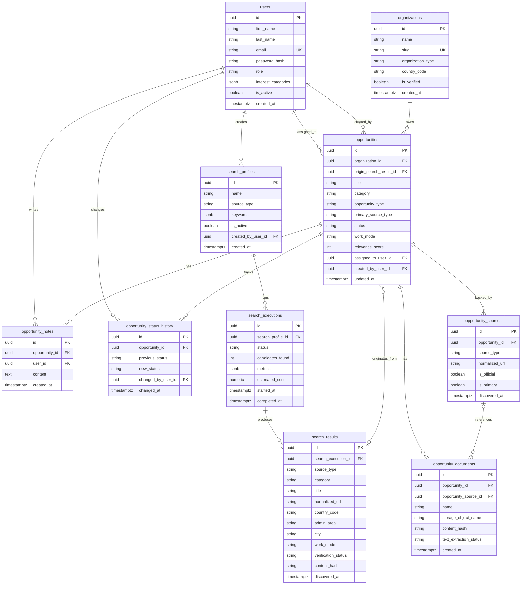
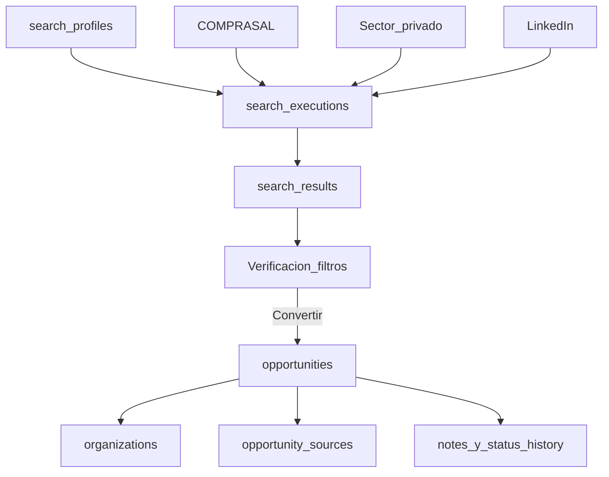

# Leadiva — Esquema de base de datos (MVP)

> **Estado:** contrato MVP congelado para implementación.  
> **Fecha:** 2026-07-15  
> **Auth MVP:** email + contraseña (Auth.js Credentials). Google OAuth en fase posterior.  
> **Audiencia:** empleados Creativa (dominios en `ALLOWED_EMAIL_DOMAINS`).

---

## 1. Alcance

Modelo de datos del MVP de inteligencia comercial (COMPRASAL, sector privado, LinkedIn).

**Separación conceptual:**

```text
search_profiles
  → search_executions
    → search_results (Proyectos / candidatos en UI)
      → opportunities (Leads en UI)
        → opportunity_sources / documents / notes / status_history
```

**Decisiones MVP fijadas:**

- `users`: `first_name`, `last_name`, `password_hash`, `interest_categories` (jsonb)
- `image_url` nullable (reservado para Google OAuth futuro)
- Dominios permitidos en env, no en tabla
- FK candidato→lead: solo `opportunities.origin_search_result_id` (sin FK inversa)
- Categorías de interés: `SOFTWARE`, `IT`, `CONSULTING`, `AI`
- Ubicación / modalidad opcionales en candidatos y leads

---

## 2. Diagrama ER principal



---

## 3. Descripción de cada tabla

### 3.1 `users`

Identidades internas. Auth Credentials (password hash). Dominios validados vía env.

| Campo | Tipo | Notas |
| --- | --- | --- |
| `id` | UUID PK | |
| `first_name` | string | |
| `last_name` | string | |
| `email` | string UK | Login |
| `password_hash` | string | bcrypt/argon2 |
| `image_url` | string nullable | Futuro OAuth |
| `role` | enum | `ADMIN`, `COMMERCIAL_ANALYST`, `TECHNICAL_REVIEWER`, `MANAGEMENT`, `VIEWER` |
| `interest_categories` | jsonb | `["SOFTWARE","IT","CONSULTING","AI"]` o `[]` |
| `is_active` | boolean | |
| `created_at` / `updated_at` | timestamptz | |

Rol al registrarse: `COMMERCIAL_ANALYST`.

### 3.2 `organizations`

Institución/empresa normalizada.

| Campo | Tipo | Notas |
| --- | --- | --- |
| `id` | UUID PK | |
| `name` | string | |
| `slug` | string UK | |
| `organization_type` | enum | `PUBLIC_INSTITUTION`, `PRIVATE_COMPANY`, `NGO`, `INTERNATIONAL_ORGANIZATION`, `OTHER` |
| `sector` | string nullable | |
| `country_code` | string | ISO alpha-2 |
| `website_url` / `linkedin_url` | string nullable | |
| `is_verified` | boolean | |
| `created_at` / `updated_at` | timestamptz | |

### 3.3 `search_profiles`

Configuración reutilizable de búsqueda.

| Campo | Tipo | Notas |
| --- | --- | --- |
| `id` | UUID PK | |
| `name` / `description` | string | |
| `source_type` | enum | `COMPRASAL`, `PRIVATE_WEB`, `LINKEDIN`, `MANUAL` |
| `keywords` / `excluded_keywords` / `countries` / `sectors` / `target_domains` | jsonb | |
| `is_active` | boolean | |
| `created_by_user_id` | UUID FK | |
| `created_at` / `updated_at` | timestamptz | |

### 3.4 `search_executions`

Corrida asíncrona de un perfil.

| Campo | Tipo | Notas |
| --- | --- | --- |
| `id` | UUID PK | |
| `search_profile_id` | UUID FK | |
| `status` | enum | `PENDING`, `RUNNING`, `COMPLETED`, `PARTIALLY_COMPLETED`, `FAILED`, `CANCELLED` |
| `queries_executed` / `candidates_found` / `candidates_discarded` / `opportunities_created` | int | Para Grounding, `candidates_found` = candidatos schema-válidos **antes** de filtros (no created+updated) |
| `input_tokens` / `output_tokens` | int | |
| `estimated_cost` | numeric | |
| `metrics` | jsonb | Diagnóstico detallado: `outcome`, stage metrics, `discardCounts`, previews truncados, `discardedTraceSample`. Ver [search-grounding-metrics.md](./search-grounding-metrics.md) |
| `error_message` | text nullable | |
| `started_at` / `completed_at` / `created_at` | timestamptz | |

### 3.5 `search_results`

Candidatos (= **Proyectos** en UI). Aún no son leads.

| Campo | Tipo | Notas |
| --- | --- | --- |
| `id` | UUID PK | |
| `search_execution_id` | UUID FK nullable | Null si seed/manual |
| `source_type` | enum | |
| `external_id` | string nullable | |
| `title` / `snippet` | string | |
| `source_url` / `normalized_url` | string | Dedupe |
| `organization_name` | string nullable | |
| `category` | string nullable | SOFTWARE / IT / CONSULTING / AI / OTHER |
| `country_code` / `admin_area` / `city` | string nullable | |
| `work_mode` | enum | `ONSITE`, `REMOTE`, `HYBRID`, `UNKNOWN` |
| `published_at` / `deadline_at` | timestamptz nullable | |
| `preliminary_score` | int nullable | |
| `verification_status` | enum | `PENDING`, `PARTIALLY_VERIFIED`, `VERIFIED`, `REJECTED` |
| `discard_reason` | string nullable | |
| `content_hash` | string nullable | |
| `raw_data` | jsonb | |
| `discovered_at` / `created_at` | timestamptz | |

Índices/únicos: `(source_type, external_id)`, `normalized_url`.

### 3.6 `opportunities`

Leads comerciales aceptados.

| Campo | Tipo | Notas |
| --- | --- | --- |
| `id` | UUID PK | |
| `organization_id` | UUID FK | |
| `origin_search_result_id` | UUID FK nullable UK | Origen único |
| `title` / `description` | string | |
| `opportunity_type` | enum | `TENDER`, `RFP`, `CONSULTING`, `PROJECT`, `VENDOR_REGISTRATION`, `REQUEST_FOR_QUOTATION`, `OTHER` |
| `primary_source_type` | enum | |
| `category` | string nullable | |
| `status` | enum | `DETECTED`, `UNDER_REVIEW`, `APPROVED`, `PREPARING_PROPOSAL`, `PROPOSAL_SENT`, `WON`, `LOST`, `DISCARDED`, `EXPIRED`, `DUPLICATE` |
| `verification_status` | enum | |
| `relevance_score` / `relevance_explanation` | | |
| `country_code` / `admin_area` / `city` / `work_mode` | | |
| `estimated_amount` / `currency` | | |
| `next_action` / `next_action_at` | text / timestamptz | Próxima acción comercial |
| `published_at` / `deadline_at` / `discovered_at` / `last_verified_at` | | |
| `assigned_to_user_id` / `created_by_user_id` | UUID FK | |
| `created_at` / `updated_at` | timestamptz | |

### 3.7 `opportunity_sources`

Evidencias (URLs) de un lead. Único `(opportunity_id, normalized_url)`.

### 3.8 `opportunity_documents`

Metadatos de archivos (binario en Cloud Storage, no en Postgres).

### 3.9 `opportunity_notes`

Comentarios internos.

### 3.10 `opportunity_status_history`

Auditoría de cambios de estado comercial.

---

## 4. Flujo de datos



---

## 5. Decisiones de diseño

1. **Proyecto ≠ Lead:** `search_results` vs `opportunities`.
2. **Una sola FK de origen:** `origin_search_result_id`.
3. **Orgs normalizadas** para dedupe y agrupación.
4. **Documentos fuera de Postgres.**
5. **Duplicados:** `normalized_url`, `(source_type, external_id)`, `content_hash`.
6. **JSONB:** perfiles, `raw_data`, `interest_categories`.
7. **Auth propia** en MVP; OAuth después.

---

## 6. Variables de entorno relacionadas

```text
DATABASE_URL=                 # Neon pooled (o NEON_DB_URL)
DATABASE_URL_DIRECT=          # opcional migraciones
AUTH_SECRET=
ALLOWED_EMAIL_DOMAINS=creativastudios.us,creativaconsultores.com,creativatechstudios.com
```

---

## 7. Elementos opcionales (fases futuras)

`organization_contacts`, `opportunity_requirements`, `opportunity_scores`, `tags`, `opportunity_collaborators`, `notifications`, `saved_filters`, `proposal_submissions`, `audit_logs`.
