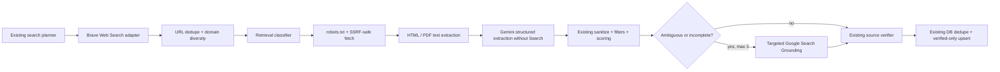

# Private web provider discovery MVP

The existing endpoint remains `POST /api/jobs/search-grounding`. The engine is
selected server-side and `GROUNDING_ONLY` remains the default.



## Local activation

Keep production on:

```env
PRIVATE_WEB_DISCOVERY_MODE=GROUNDING_ONLY
```

For a controlled local run, add the secret only to `.env.local` or the
deployment secret manager:

```env
PRIVATE_WEB_DISCOVERY_MODE=PROVIDER_SEARCH
BRAVE_SEARCH_API_KEY=your_subscription_token
```

The key is server-only and is sent as `X-Subscription-Token`. It must never use
a `NEXT_PUBLIC_` name. Missing credentials produce
`PROVIDER_NOT_CONFIGURED`; the application does not silently fall back to
Grounding.

The adapter uses only Brave's standard Web Search endpoint. It does not use
Answers, Summarizer, or LLM Context. See the official
[Web Search documentation](https://api-dashboard.search.brave.com/documentation/services/web-search)
and [authentication guide](https://api-dashboard.search.brave.com/documentation/guides/authentication).

## Safety boundaries

- Fetches use only HTTP(S), omit credentials/cookies, execute no remote
  JavaScript and perform no authentication or CAPTCHA bypass.
- URL structure and public DNS are checked before robots and again immediately
  before each document request. Redirects are manual and every hop is checked.
- `robots.txt` is evaluated for the configured User-Agent and cached per origin.
  Unavailable or disallowed policies fail closed for document retrieval.
- HTML scripts, styles, navigation and repeated chrome are removed locally.
- PDFs require a valid `%PDF-` signature and are parsed without OCR. Size and
  page limits apply before text is sent to Vertex.
- The classifier only selects retrieval candidates. Existing commercial
  filters, vigency, scoring, verification and verified-only persistence remain
  authoritative.

## Budget controls

All request counts, concurrency, bytes, pages, tokens, retries and estimated
cost limits are validated in `src/env/server.ts` and documented in
`.env.example`. Provider requests are reserved against the cost ceiling before
concurrent execution. `429` and `5xx` use bounded retries, `Retry-After` or
Brave rate-limit reset headers, exponential backoff and jitter.

The provider request estimate defaults to USD 0.005 per request and is
configurable with `BRAVE_SEARCH_COST_PER_REQUEST`. It is an observability
estimate, not an invoice.

## Known MVP limits

- PDF OCR is intentionally absent; image-only PDFs report
  `PDF_NO_EXTRACTABLE_TEXT`.
- HTML extraction is static and does not render JavaScript applications.
- DNS is revalidated around requests, but Node's global `fetch` does not pin the
  validated IP to the connection; network-layer egress controls remain
  recommended in production.
- The Vertex cost metric includes extraction and targeted Grounding token usage
  exposed by the SDK. Existing URL Context verification calls do not yet expose
  complete per-call billing attribution.
- `robots.txt` compliance does not itself grant copyright or contractual
  permission to reuse content.

